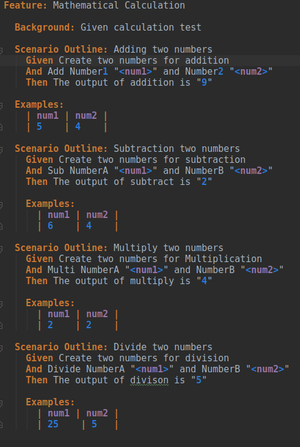
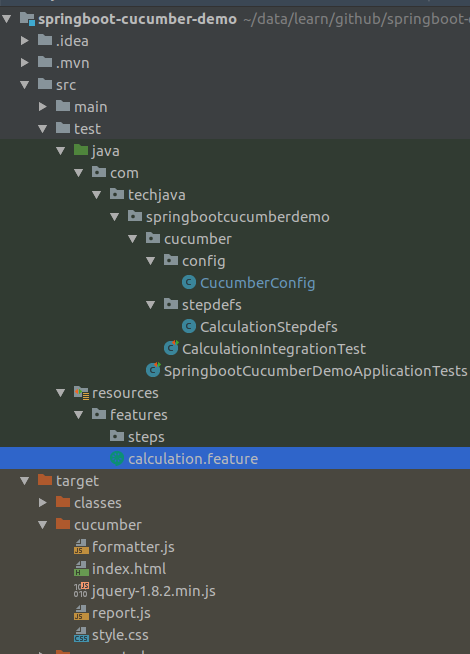
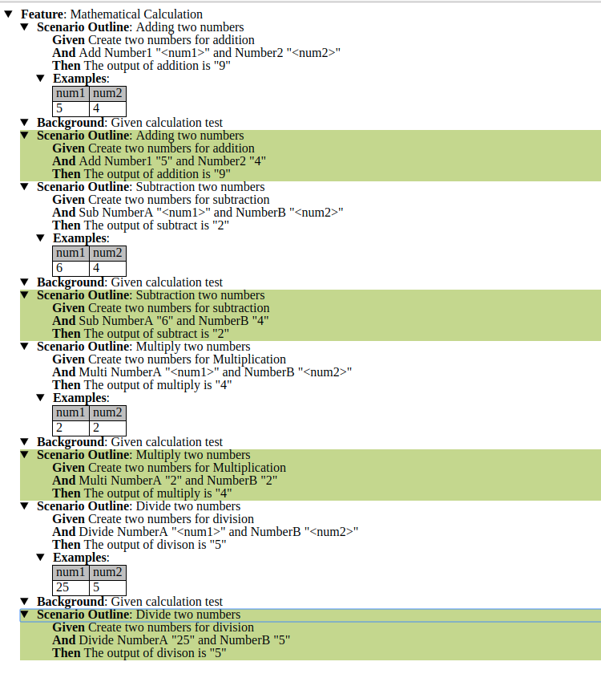

# springboot-cucumber-demo
This project explains how to use BDD using cucumber in springboot

### Cucumber

    * Cucumber is a high-level testing framework that supports behaviour driven development.
    
    * It runs automated acceptance tests on web applications
    
    * Cucumber is a tool that executes plain-text functional descriptions as automated tests. 
      The language that Cucumber understand is Gherkin.
      

       Flow :
    
        1. Describe behaviour.
        2. Write Step definition.
        3. Run and Fail.
        4. Write code to make step pass.
        5. Run and pass.

### Feature File Introduction
    
    Feature Introduction Every .feature file conventionally consists of a single feature.
    A line starting with the keyword Feature followed by free indented text starts a feature. 
    A feature usually contains a list of scenarios. scenarios together independent of your file and directory structure.
    
    Given -> What software will look like to user
    
    When  -> Things that the user will do
    
    Then  -> What the user should expect
    
### Cucumber Structure

• Feature: Single file, ideally describing a single feature 
• Scenario: A test case 
• Given-When-Then: Test Preconditions, Execution and Postconditions 
• And: Additional test constructs
    

### Calculator Application

    Here I take simple calculation application which has addition, subtraction, multiplication and divison.
    
    I made simple calcuation service in rest using springboot for add, sub, multi and divide.
    
        For example if you hit the url after the starting spring boot application the output will be like this.
        
              Rest URL : http://localhost:8081/calc/add/5/4
              Output   : Addition of 5 + 4 is 9
              
        Similar for sub, multi and divide.
        
### Cucumber Configuration and Feature File

* calculation.feature

 
        
        
* CalculationIntegrationTest.java
```
@RunWith(Cucumber.class)
@CucumberOptions(features = "src/test/resources/features", plugin = {"pretty", "html:target/cucumber"}, glue = {"com.techjava.springbootcucumberdemo.cucumber.stepdefs"})
public class CalculationIntegrationTest {
}

```

* CucumberConfig.java
```
@ContextConfiguration
@SpringBootTest(classes = SpringbootCucumberDemoApplication.class, webEnvironment = SpringBootTest.WebEnvironment.RANDOM_PORT)
public class CucumberConfig {

    @Autowired
    public TestRestTemplate testRestTemplate;

    @LocalServerPort
    public int port;

    public String staticURL = "http://localhost:";

    public HttpHeaders httpHeaders;

    @Before
    public void setUp() throws Exception {
        httpHeaders = new HttpHeaders();
    }
}
```

* CalculationStepdefs.java

```
public class CalculationStepdefs extends CucumberConfig {

    private ResponseEntity<String> responseEntity;

    private String result_add = "Addition of 5 + 4 is 9";
    private String result_sub = "Subtraction of 6 - 4 is 2";
    private String result_multi = "Multiple of 2 * 2 is 4";
    private String result_divi = "Divide of 25 / 5 is 5";

    @Given("^Create two numbers for addition$")
    public void createTwoNumbersForAddition() throws Throwable {
        String URI="/calc";
        getCompleteEndPoint(URI);
    }

    @And("^Add Number(\\d+) \"([^\"]*)\" and Number(\\d+) \"([^\"]*)\"$")
    public void addNumberAndNumber(int arg0, String arg1, int arg2, String arg3) throws Throwable {
        String URI = "/calc/add/" + arg1 +"/"+arg3;
        responseEntity = testRestTemplate.getForEntity(getCompleteEndPoint(URI), String.class);
        Assert.assertEquals("5", arg1);
        Assert.assertEquals("4", arg3);
    }

    @Then("^The output of addition is \"([^\"]*)\"$")
    public void theOutputOfAdditionIs(String arg0) throws Throwable {
        Assert.assertEquals(result_add, responseEntity.getBody());
    }

    public String getCompleteEndPoint(String URI){
        System.out.println("Complete URL--->" + (staticURL + port + URI));
        return staticURL + port + URI;
    }

    @Given("^Create two numbers for subtraction$")
    public void createTwoNumbersForSubtraction() throws Throwable {
        String URI="/calc";
        getCompleteEndPoint(URI);
    }

    @And("^Sub NumberA \"([^\"]*)\" and NumberB \"([^\"]*)\"$")
    public void subNumberAAndNumberB(String arg0, String arg1) throws Throwable {
        String URI = "/calc/sub/" + arg0 +"/"+arg1;
        responseEntity = testRestTemplate.getForEntity(getCompleteEndPoint(URI), String.class);
        Assert.assertEquals("6", arg0);
        Assert.assertEquals("4", arg1);
    }

    @Then("^The output of subtract is \"([^\"]*)\"$")
    public void theOutputOfSubtractIs(String arg0) throws Throwable {
        Assert.assertEquals(result_sub, responseEntity.getBody());
    }

    @Given("^Create two numbers for Multiplication$")
    public void createTwoNumbersForMultiplication() throws Throwable {
        String URI="/calc";
        getCompleteEndPoint(URI);
    }

    @And("^Multi NumberA \"([^\"]*)\" and NumberB \"([^\"]*)\"$")
    public void multiNumberAAndNumberB(String arg0, String arg1) throws Throwable {
        String URI = "/calc/multiply/" + arg0 +"/"+arg1;
        responseEntity = testRestTemplate.getForEntity(getCompleteEndPoint(URI), String.class);
        Assert.assertEquals("2", arg0);
        Assert.assertEquals("2", arg1);
    }

    @Then("^The output of multiply is \"([^\"]*)\"$")
    public void theOutputOfMultiplyIs(String arg0) throws Throwable {
        Assert.assertEquals(result_multi, responseEntity.getBody());
    }

    @Given("^Create two numbers for division$")
    public void createTwoNumbersForDivision() throws Throwable {
        String URI="/calc";
        getCompleteEndPoint(URI);
    }

    @And("^Divide NumberA \"([^\"]*)\" and NumberB \"([^\"]*)\"$")
    public void divideNumberAAndNumberB(String arg0, String arg1) throws Throwable {
        String URI = "/calc/divide/" + arg0 +"/"+arg1;
        responseEntity = testRestTemplate.getForEntity(getCompleteEndPoint(URI), String.class);
        Assert.assertEquals("25", arg0);
        Assert.assertEquals("5", arg1);
    }

    @Then("^The output of divison is \"([^\"]*)\"$")
    public void theOutputOfDivisonIs(String arg0) throws Throwable {
        Assert.assertEquals(result_divi, responseEntity.getBody());
    }
}

```

### Project Structure




### Test Results (After running the feature file or CalculationIntegrationTest.java)




### Happy Coding
